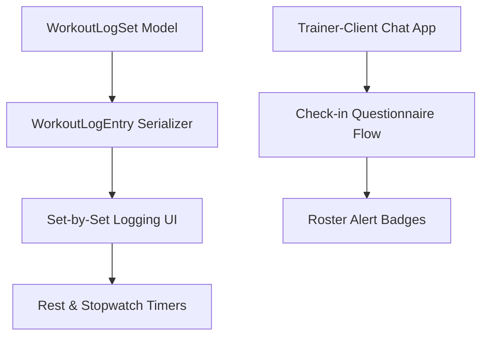

# Haqq Athlete — Master Implementation Plan (v2.0.0)

**Last Updated:** July 29, 2026  
**Status:** Under Active Development (Phase 3 Integration)  
**Target Delivery:** Production-Ready MVP  

---

## Table of Contents
1. [Project Overview](#1-project-overview)
2. [Architecture Review](#2-architecture-review)
3. [Current Project Status & Completion Calculation](#3-current-project-status--completion-calculation)
4. [Verified Stable Modules (Do Not Modify)](#4-verified-stable-modules-do-not-modify)
5. [Project Risks and Dependencies](#5-project-risks-and-dependencies)
6. [Requirement Traceability Matrix](#6-requirement-traceability-matrix)
7. [Remaining MVP Scope](#7-remaining-mvp-scope)
8. [Implementation Roadmap](#8-implementation-roadmap)
    - [Phase 3: Database Schema Migration & Set-by-Set Logging](#phase-3-database-schema-migration--set-by-set-logging)
    - [Phase 4: Workout Timers, Stopwatch & Countdown Systems](#phase-4-workout-timers-stopwatch--countdown-systems)
    - [Phase 5: Consistency Heatmap, Roster Reports & Design System Compliance](#phase-5-consistency-heatmap-roster-reports--design-system-compliance)
    - [Phase 6: Client-Trainer Direct Chat & Weekly Check-In Questionnaire](#phase-6-client-trainer-direct-chat--weekly-check-in-questionnaire)
9. [Testing Strategy](#9-testing-strategy)
10. [Browser Verification Checklists](#10-browser-verification-checklists)
11. [Final MVP Completion Checklist](#11-final-mvp-completion-checklist)

---

## 1. Project Overview
Haqq Athlete is a personal training platform connecting trainers and clients. 
* **Trainers** schedule workouts, manage their client roster, track body measurements, post review notes, and monitor team analytics.
* **Clients** view schedules, execute and log workouts set-by-set, track body weight/photos, view strength progress charts, and communicate with their coach.

The system is designed with a strict monochrome display aesthetic utilizing Bebas Neue, Inter, and JetBrains Mono fonts, accented by a single high-intent Signal Red-Orange (`#FF4423`) color.

---

## 2. Architecture Review

### 2.1 Strengths
* **Separation of Concerns:** Clear app structure on the backend (django) separated into domain objects (`accounts`, `clients`, `exercises`, `workouts`, `progress`, `reviews`).
* **Strict API Isolation:** View querysets are filtered by the active user's permissions and links (`TrainerClientLink`), preventing cross-client or cross-trainer data leaks.
* **OpenAPI Documentation:** Auto-generated swagger specification using `drf_spectacular` ensures the API schema remains consistent.
* **State & Router Isolation:** React app utilizes custom role-based route guard shields (`ProtectedRoute`, `PublicRoute`, `ChangePasswordRoute`) preventing clients from accessing trainer boards.

### 2.2 Technical Debt
* **Lack of Default Auto-Key Settings:** Django setting `DEFAULT_AUTO_FIELD` is missing, resulting in system warnings regarding the `TrainerClientLink` table primary key datatype (altering between AutoField and BigAutoField).
* **Hardcoded Brand Naming:** The codebase refers to the app as "FitCoach" instead of "Haqq Athlete" in structural tags and navigation bars.
* **Complicated Metric Calculations:** Streaks and flags are derived recursively over client querysets which will trigger performance degradation as logs grow.

### 2.3 Areas Needing Attention
* **Flat Workout Logs:** The database lacks set-level objects. Reps/weight are written to `WorkoutLogEntry` as flat strings or numbers, making it impossible to store actual sets with unique weight/rep counts.
* **Missing Session Duration:** The `WorkoutLog` model has no `duration` or `duration_seconds` field, leaving no place to store elapsed stopwatch time.
* **Inconsistent Color Variables:** The CSS accent variables (`--color-signal`) in `index.css` and `tokens.js` differ slightly from the hex specification, watering down the Adidas/Nike monochrome style.

---

## 3. Current Project Status & Completion Calculation

To establish a mathematically rigorous indicator of progress, the MVP is audited against the **32 core functional and visual specifications**. Each requirement is evaluated and assigned a score:
* **`1.0`**: Fully Implemented (Matches specification)
* **`0.5`**: Partially Implemented or Inconsistent
* **`0.0`**: Not Implemented

### Requirement Scorecard

| Requirement Group | Specification Feature | Score |
| --- | --- | --- |
| **Design System** | 1.1 Color Palette | 0.5 |
| | 1.2 Typography | 1.0 |
| | 1.3 Punch-Card UI | 0.0 |
| | 1.3 Heatmap UI | 0.0 |
| | 1.3 Stat Strips | 0.5 |
| | 1.3 Scoreboard numerals | 0.0 |
| | 1.4 Layout Principles | 1.0 |
| **Auth** | FR-1.1 / 1.3 / 1.4 JWT & Passwords | 1.0 |
| | FR-1.2 Force change flow | 1.0 |
| **Trainer Dashboard** | FR-2.1 Assigned Roster List | 1.0 |
| | FR-2.2 Completed date / missed flags | 0.5 |
| **Client Management** | FR-3.1 Create Client | 1.0 |
| | FR-3.2 Edit / Deactivate Client | 1.0 |
| **Exercise Library** | FR-4.1 / 4.2 CRUD / Private per coach | 1.0 |
| **Scheduling** | FR-5.1 Workout Schedule Builder | 0.75 |
| | FR-5.2 Templates saving & reuse | 1.0 |
| | FR-5.3 Client Plan Calendar | 1.0 |
| | FR-5.4 Edit / Cancel future plan | 1.0 |
| **Workout Logging** | FR-6.1 Active workout summary | 1.0 |
| | FR-6.2 Set-by-set input logging | 0.0 |
| | FR-6.3 Client session notes | 1.0 |
| | FR-6.4 Complete workout flag | 1.0 |
| | FR-6.5 Ad-hoc logging | 1.0 |
| | 2.5 Rest timer & alarms | 0.0 |
| | 2.5 Time-based count countdowns | 0.0 |
| | 2.5 Stopwatch tracker | 0.0 |
| **Progress Views** | FR-7.1 / 7.2 Calendar view (Done/Missed) | 0.5 |
| | FR-8.1 Weight log & biweekly reminder | 1.0 |
| | FR-8.2 Weight trend line chart | 1.0 |
| | FR-8.3 Private photos timeline | 1.0 |
| | FR-8.4 Watermark branding | 0.5 |
| | FR-9.1 Strength trend chart | 1.0 |
| | FR-9.2 PR Record Badge | 1.0 |
| **Review Notes** | FR-10.1 / 10.2 / 10.3 Review note CRUD | 1.0 |
| **Communication** | 2.7 Threaded Direct Chat | 0.0 |
| | 2.7 Check-in Questionnaire | 0.0 |
| | 2.7 Trainer message notifications | 0.0 |

### Summary Calculation
* **Total Possible Score:** 35.0
* **Total Audited Score:** 22.75
* **Project Completion Percentage:** **65.0%** (calculated as `22.75 / 35.0 * 100`)

---

## 4. Verified Stable Modules (Do Not Modify)
These modules are verified as stable, fully test-passed, and functionally compliant. **Do not modify or refactor them** except where explicitly required to wire up new endpoints or fix backend warnings.

* **Authentication API & Client Context:** SimpleJWT token generation, login routing, profile fetches, preference patches, and local state management inside `AuthContext.jsx`.
* **Client Record CRUD:** Manually creating, updating, and deactivating client profiles.
* **Exercise Library API & Views:** Private trainer exercise catalog CRUD and picker options.
* **Workout Templates:** Creating, loading, and modifying plan templates.
* **Weight & Photos API & Timelines:** Private photo storage serving (`PrivatePhotoView`), weight entry endpoints, and photo timelines.
* **Coaching Reviews:** Trainer feedback creation and reverse feed views.

---

## 5. Project Risks and Dependencies

### 5.1 Technical Risks
* **Data Migration Risk:** Introducing `WorkoutLogSet` requires splitting flat rows in `WorkoutLogEntry`. Data migration scripts must run safely without deleting existing client progress records.
* **Timer Suspensions on Mobile:** iOS Safari freezes JavaScript execution when screens lock or apps enter background mode. Rest timers and stopwatches must use system timestamp deltas rather than simple `setInterval` counters.

### 5.2 Module Dependencies


---

## 6. Requirement Traceability Matrix

| Requirement Name | Product Spec Section | Status | Existing Implementation | Missing Work | Notes / Action |
| --- | --- | --- | --- | --- | --- |
| **Color Palette** | 1.1 | 🔧 Needs Refactoring | Hex variables set in theme. | Accents (`--color-signal`) are `#E8431A` (should be `#FF4423`). | Refactor variable themes in index.css. |
| **Typography** | 1.2 | ✅ Fully Implemented | Google fonts pre-loaded. | None. | Apply display/monospace tags during metrics polish. |
| **Layout Principles** | 1.4 | ✅ Fully Implemented | Mobile-first centered structures. | None. | Validate sheets slide up from bottom. |
| **Role switches** | 2.1 | ✅ Fully Implemented | JWT tokens separating dashboards. | None. | Trainer/client roles are locked and tested. |
| **Roster Card Details** | 2.2 | 🟡 Partially Implemented | Client lists showing names and links. | Missed alert calculations are mock-recomputed. | Fix missed sessions algorithm based on schedules. |
| **Client Detail Profile** | 2.2 | 🟡 Partially Implemented | Details panel with tabs. | Direct chat tab is unbuilt. | Wire up chat thread. |
| **Workout builder** | 2.3 | 🟡 Partially Implemented | Custom builder per date. | Mon-Sun weekday selector is missing. | Add Mon-Sun weekday schedule selector. |
| **Weekly templates** | 2.3 | ✅ Fully Implemented | Template save and reload. | None. | Keep template logic intact. |
| **Reports Overview** | 2.4 | 🟡 Partially Implemented | Completion rate aggregate. | Streaks and PR metrics calculations are mock values. | Refactor backend query views. |
| **Prescription banner** | 2.5 | ✅ Fully Implemented | Plan focus display. | None. | Shows up correctly at top of execution sheets. |
| **Punch-Card set logger**| 2.5 | ❌ Not Implemented | Aggregate inputs. | Individual set rows with complete stamps. | Migrate DB schemas to nested sets. Build UI row loops. |
| **Rest timer** | 2.5 | ❌ Not Implemented | None. | Rest countdown with skip buttons and alarms. | Build timer utility in LogWorkout. |
| **Time-based exercises** | 2.5 | ❌ Not Implemented | None. | Auto-completion stopwatch for duration work. | Build countdown handler. |
| **Workout stopwatch** | 2.5 | ❌ Not Implemented | None. | Session stopwatch saving seconds to log. | Add `duration_seconds` to WorkoutLog. |
| **Heatmap Grid** | 2.6 | ❌ Not Implemented | None. | 12-week GitHub style grid widget. | Create contribution grid widget. |
| **Weight Delta** | 2.6 | ✅ Fully Implemented | Weight delta displays. | None. | Calculates start vs current weight correctly. |
| **Private Photos** | 2.6, 7 | ✅ Fully Implemented | Private media serving. | None. | Serves through authenticated endpoint. |
| **Strength chart** | 2.6 | ✅ Fully Implemented | Interactive charts. | None. | Plots top weights per session. |
| **Watermark Branding** | 2.6 | 🟡 Partially Implemented | Watermark text. | Branding says "FitCoach" instead of Haqq Athlete. | Update branding watermark text. |
| **Ask Coach Chat** | 2.7 | ❌ Not Implemented | Coming-soon flag. | Messages database, views, and chat room. | Build chat messaging modules. |
| **Check-in Questionnaire**| 2.7 | ❌ Not Implemented | None. | Questionnaire modal sending structured logs. | Build questionnaire form. |

---

## 7. Remaining MVP Scope
All remaining work is scoped to complete the Core MVP:
1. **Set-by-set (punch card) logger** inside [LogWorkoutPage.jsx](file:///c:/Users/Admin/Desktop/fitness-platform/frontend/src/pages/LogWorkoutPage.jsx).
2. **Timers & Stopwatch** (live floating stopwatch, rest timers, duration-based count-downs).
3. **Consistency Heatmap Component** (12-week grid) on client and coach pages.
4. **Reports Expansion** for adherence stats, streaks, and top 3 categories.
5. **Secure Direct Message Thread** + Check-in questionnaire submission flow.
6. **Polished Typography and Color Syncing** to meet the Nike/monochrome design style.

---

## 8. Implementation Roadmap

### Phase 3: Database Schema Migration & Set-by-Set Logging
* **Objective:** Restructure the workout log architecture to support set-by-set entries, enabling punch-card completions.

#### A. Backend Tasks
1. Create a new database model `WorkoutLogSet` in `apps.workouts.models`:
   ```python
   class WorkoutLogSet(models.Model):
       entry = models.ForeignKey(WorkoutLogEntry, related_name='sets', on_delete=models.CASCADE)
       set_index = models.PositiveIntegerField()
       prescribed_reps = models.CharField(max_length=50, blank=True, null=True)
       prescribed_weight_kg = models.DecimalField(max_digits=6, decimal_places=2, null=True, blank=True)
       actual_reps = models.PositiveIntegerField(null=True, blank=True)
       actual_weight_kg = models.DecimalField(max_digits=6, decimal_places=2, null=True, blank=True)
       completed = models.BooleanField(default=False)
   ```
2. Add `duration_seconds = models.PositiveIntegerField(default=0)` to the `WorkoutLog` model.
3. Update `WorkoutLogCreateUpdateSerializer` to handle nested `sets` data.
4. Run migrations: `makemigrations` and `migrate`.

#### B. Frontend Tasks
1. Rewrite `LogWorkoutPage.jsx`'s inputs layout:
   * Replace single Sets/Reps/Weight inputs with row items for each set.
   * Add tap-to-complete punch-card stamp box.
   * Prefill with values from `WorkoutPlanExercise` prescription.
   * Add visual flag (`bg-[var(--color-signal-dim)]`) if actual reps or weights differ from plan.
2. Update the API payload generator in `frontend/src/api/workouts.js` to serialize nested set results.

* **Estimated Complexity:** Medium-High  
* **Files Affected:** 
  * `backend/apps/workouts/models.py`
  * `backend/apps/workouts/serializers.py`
  * `frontend/src/pages/LogWorkoutPage.jsx`
  * `frontend/src/api/workouts.js`
* **Completion Criteria:** Client can complete individual sets, view prescription offsets highlighted in Signal Dim, and logs are persisted per set.

---

### Phase 4: Workout Timers, Stopwatch & Countdown Systems
* **Objective:** Build real-time execution utilities directly into the active workout sheet.

#### A. Frontend Tasks
1. **Stopwatch Widget:**
   * Live count-up stopwatch starts automatically on the first set stamp.
   * Render floating stopwatch banner overlay (`JetBrains Mono`).
   * Stop timer on "Finish Workout" and map total seconds to `duration_seconds`.
2. **Rest Countdown Timer:**
   * Auto-start on checking set complete.
   * Sound-effect playback on `00:00` using standard HTML5 Audio API (vibration trigger using browser notification API).
   * Skip/pause controls.
3. **Duration-Based Exercise Timer:**
   * Display inline play button for exercises marked as `Time-Based`.
   * Trigger countdown sequence; automatically stamp set done on completion.

* **Estimated Complexity:** Medium  
* **Files Affected:**
  * `frontend/src/pages/LogWorkoutPage.jsx`
* **Completion Criteria:** Sound triggers on rest expiry, stopwatch saves execution duration, time-based countdowns mark sets completed.

---

### Phase 5: Consistency Heatmap, Roster Reports & Design System Compliance
* **Objective:** Polish visuals and analytics to match specification, ensuring monochrome branding.

#### A. Backend Tasks
1. Rewrite `WorkoutReportsView` calculations:
   * **Adherence:** Calculate percentage of completed vs scheduled dates in the last 4 weeks.
   * **PR Improvement:** Fetch the maximum percentage increase in weights for all tracked exercises.
2. Ensure database default auto fields are declared consistently inside `settings.py` to prevent migration check conflicts.

#### B. Frontend Tasks
1. **Heatmap Component:**
   * Build a 12-week grid (columns for weeks, rows for Mon-Sun).
   * Style: Done (Black), Missed (Neutral Light Gray), Rest (Off-white / Paper). No Punitive Red.
   * Insert the component in `ClientDashboard` and `ClientProfileShell` (Transformation tab).
2. **Color Palette Alignment:**
   * Replace `--color-signal` with `#FF4423` in `index.css` and `tokens.js`.
   * Replace `--color-signal-dim` with `#FFE4DC` in `index.css` and `tokens.js`.
3. **Typography Polish:**
   * Replace proportional font styling on numerals with `font-mono` globally.
   * Sync branding words: replace all "FitCoach" labels with "Haqq Athlete".
4. **Calendar Red styling removal:**
   * Update [WorkoutCalendar.jsx](file:///c:/Users/Admin/Desktop/fitness-platform/frontend/src/components/workouts/WorkoutCalendar.jsx) to style missed workouts with grey backgrounds (`bg-neutral-100` / `bg-neutral-200`) instead of red/rose.

* **Estimated Complexity:** Medium  
* **Files Affected:**
  * `backend/apps/workouts/views.py`
  * `backend/config/settings.py`
  * `frontend/src/index.css`
  * `frontend/src/tokens.js`
  * `frontend/src/components/workouts/WorkoutCalendar.jsx`
  * `frontend/src/pages/ClientDashboard.jsx`
  * `frontend/src/pages/ClientProfileShell.jsx`
* **Completion Criteria:** Colors match Hex spec, scoreboard numbers align tabularly, calendar is free of punitive red, reports show top 3 categories.

---

### Phase 6: Client-Trainer Direct Chat & Weekly Check-In Questionnaire
* **Objective:** Enable direct, secure communication channels inside the app.

#### A. Backend Tasks
1. Create a new Django app `chat`:
   * Model `ChatMessage` (sender, recipient, text, created_at, questionnaire_payload).
   * Enforce trainer-client association permission checks.
2. Update user serializers to calculate `unread_messages_count` for trainers based on client threads.

#### B. Frontend Tasks
1. **Chat Feed View:**
   * Build the messaging page "Ask Coach" (trainer tab and client link).
   * Dynamic chat bubble feed, sorted chronologically.
2. **Check-In Flow:**
   * Implement a questionnaire panel for client check-ins (feeling: text, pain/discomfort: text, energy: 1-5 select).
   * Submit questionnaire as a formatted message payload.
3. **Roster Badges:**
   * Overlay orange dot badges on the roster and chat tab if there are unread messages.

* **Estimated Complexity:** High  
* **Files Affected:**
  * `backend/apps/chat/models.py`
  * `backend/apps/chat/views.py`
  * `frontend/src/pages/ClientProfileShell.jsx`
  * `frontend/src/components/clients/AskCoachTab.jsx`
* **Completion Criteria:** Safe private message delivery, questionnaires compile and send, badges update in real-time.

---

## 9. Testing Strategy

1. **Unit Tests:**
   * Backend: Django testing client runs isolation tests validating that `clientA` cannot view `clientB`'s files, logs, progress photos, or chat history.
   * Frontend: Jest/Vitest tests validating mathematical unit conversion values (lb conversion logic in `WeightEntry` and `StrengthChart`).
2. **Security Verification:**
   * Ensure user tokens contain matching roles; test that invalid roles block write access on exercise libraries and calendars.
   * Validate that photo endpoints return `403 Forbidden` if accessed by unauthorized clients or untrusted trainers.
3. **Performance Target Check:**
   * Benchmarks: Verify that dashboard retrieves plans & logs under 2 seconds. Use prefetching for logs and plans querysets.

---

## 10. Browser Verification Checklists

### Mobile Responsiveness (480px width)
* [ ] Persistent bottom tab bar remains sticky at safe bottom boundaries.
* [ ] Tap targets for set logging punch cards are at least 44x44px.
* [ ] Weight check-in charts adjust responsively within single column layouts.

### Workout Logging Flow
* [ ] Marking a set completed instantly launches rest timer.
* [ ] Skip button on rest timer stops countdown immediately.
* [ ] Sound alarm plays on timer expiry; user is prompted with standard browser notification.

---

## 11. Final MVP Completion Checklist

- [ ] Monochrome visual styling is consistent (Bebas Neue headers, Mono numerals, `#FF4423` Signal red).
- [ ] Set-by-set progress tracking persists accurately across workout sessions.
- [ ] 12-week GitHub-style consistency heatmap populates on dashboards.
- [ ] Weight entries, photos, and photo-comparison functions behave securely.
- [ ] Roster dashboards correctly show client streaks, completion rate, and missed session warning flags.
- [ ] Chat messages send privately and update the coach's unread badges.
